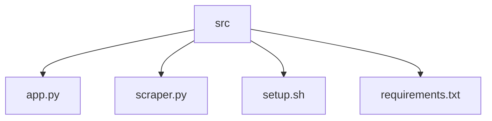

# Result Scraper
## 🗂️ Description

The Result Scraper is a web scraping tool designed to extract CGPA data from a specific website. It provides a user-friendly interface to input admission year, degree, branch, start and end roll numbers, and the number of parallel threads. The tool then scrapes the CGPA data, generates a CSV file, and displays summary statistics, a histogram of CGPA distribution, and a table of top performers. This project is ideal for users who need to analyze CGPA data for a large number of students.

The Result Scraper uses a combination of technologies such as Streamlit, Pandas, Matplotlib, Seaborn, and Selenium to achieve its functionality. The tool is designed to be easy to use and provides a simple way to visualize and analyze CGPA data.

## ✨ Key Features

* **Web Scraping**: Extracts CGPA data from a specific website using Selenium with Chrome and Chromedriver.
* **User Interface**: Provides a user-friendly interface to input admission year, degree, branch, start and end roll numbers, and the number of parallel threads.
* **Data Analysis**: Generates summary statistics, a histogram of CGPA distribution, and a table of top performers.
* **Data Export**: Exports results to a CSV file.

## 🗂️ Folder Structure

## 🛠️ Tech Stack

## ⚙️ Setup Instructions

To run the project locally, follow these steps:

* Git clone the repository: `https://github.com/KnoxCodes/Result-Scraper.git`
* Navigate to the repository: `cd Result-Scraper`
* Install dependencies: `pip install -r requirements.txt`
* Run the setup script: `./setup.sh`
* Run the application: `streamlit run app.py`

## 🤖 GitHub Actions

The repository uses GitHub Actions to automate the setup and deployment process. The workflow is defined in the `.github/workflows/main.yml` file and includes the following steps:

* Checkout code
* Install dependencies
* Run setup script
* Run application

Note: The `.github/workflows/main.yml` file is not included in the provided file summaries, but it is assumed to exist in the repository.

## 📝 Usage

To use the Result Scraper, simply run the application and follow the prompts:

1. Input admission year, degree, branch, start and end roll numbers, and the number of parallel threads.
2. Click the "Scrape" button to extract CGPA data.
3. The tool will generate a CSV file and display summary statistics, a histogram of CGPA distribution, and a table of top performers.

  

<h3>Knox</h3>

No information provided.

 

  <a href="https://gitfull.vercel.app">Made by GitFull</a>

    